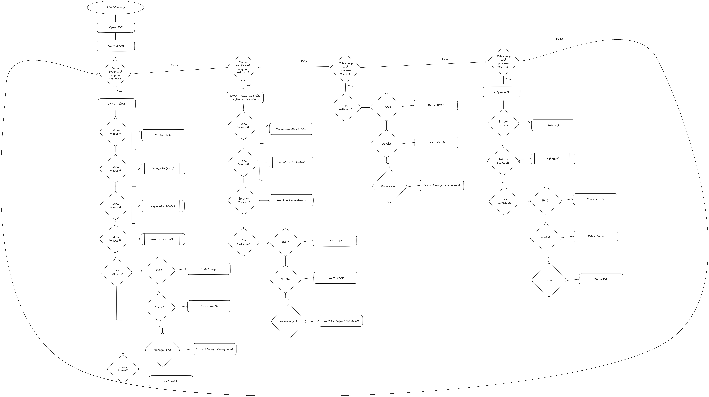

# 11 Software Engineering Task 1 Documentation

---

## Functional Requirements

---

### Data Retrieval

---

1. The user must be capable of obtaining the Astronomy Picture Of the Day and any related data including the title, date and explanation of what the picture is. They must be capable of retriving this data for any previous APOD dates.
2. It should be able of accessing NASA's photos of Earth.
(More would be done... but rate limits exist prohibiting use of a majority of the API's uses)

---

### User Interface

---

The user must be capable of interacting with the system via a tkinter GUI, with seperate tabs for each individual function of the program. They must be capable of viewing the generated images or data within the GUI, the GUI must also be capable of presenting Errors caused by user input or general API issues.

---

### Data Display

---

The user must be capable of retrieving the daily APOD of any date and the explanation of what it is from the system, the user must also be capable of opening the link to the APOD in the case they wish to save the image for personal use. The user should also be capable of retriving some of NASA's earth photos (high chance it'll fail due to the API's limitations) and opening a link to the image to save for personal use.

---
---

## Non-Functional Requirements

---

### Performance

---

The program should be able to access and load anything from the priorly mentioned sections of the NASA API in a matter of seconds (unless rate limited). It shouldn't require multiple attempts to access one piece of data (unless ratelimited).

---

### Reliability

---

The system must be consistently functional (unless rate-limited) explaining any possible issues that may have occured and it should always be capable of accessing the most recent daily APOD immediately and access any specific date if desired without issue.

---

### Usability and Accessibility

---

The system must be easily navigatable to the degree such that it is immediately clear what is required for the user to do and the definition of a valid input is immediately clear, it should also be obvious on how to access each tab of the GUI and what each button does.

---
---

## Functional Specifications

---
---

### User Requirements

---

The user must be capable of:

1. Accessing the daily APOD
2. Accesing the explanation of the daily APOD
3. Opening the image URL of the daily APOD from within the program
4. Doing 1-3 with the APOD of any previous dates
5. Access NASA's earth images service
6. Doing 3 but with the NASA earth images service

---

### Inputs and Outputs

---

The program will be capable of recieving the following inputs:

1. The date for the select APOD
2. The date for the NASA earth images service
3. The latitude for the NASA earth images service
4. The longtitude for the NASA earth images service
5. The dimensions (1 number) for the NASA earth images service

and the following outputs:

1. The daily APOD
2. The APOD of any previous date
3. The APOD explanation for any date
4. The NASA earth images
5. The image URLs for 1,2 and 4

---

### Core Features

---

The program must essetinally be capable of accessing the daily APOD (and its explanation) and the APOD and explanation of any previous date and load all of these within the GUI itself whilst also letting the user open the image link with the press of a button. The program must also be capable of accessing the NASA earth images service, load those images within a GUI and finally open the image URL with the press of a button.

---

### User interaction

---

The user will interact with the program via a tkinter GUI, using buttons and tkinter entry boxes and text boxes to allow the user to interact with the program, it must provide information such as the nessecary formatting for inputs to allow the user to enter in their input in a format that can be used.

---

### Error Handling

---

Several errors may occur whilst the program is running, these may be due to invalid user input or issues with accessing the API itself (such as rate limiting), luckily the requests module has several built in exceptions to handle these errors and any further errors can be accounted for (such as recieving nothing due to rate limiting via a KeyError exception).

---
---

## Non-Functional Specifications

---
---

### Performance (Specifications)

---

The program should be capable of running most functions (that don't rely heavily on accessing the web) in under a second (I cannot fix bad internet), this can be done by minimising the steps functions go through to complete a simple task and with some simple optimisations (such as using less global variables).

---

### Usability/Accessibility

---

The program could be made more accessible by using simple colours that contrast each other, ensuring that the user is capable of seeing it even with poor eyesight, the text should not be tiny to allow for ease of reading.

---

### Reliability (Specifications)

---

The program could suffer from an API retrival crash, the best that can be done is to simply warn the user when it has happened, not much else is required as it doesn't save user data.

---
---

## Use Cases

---
---

### Data Retrieval (Use Case)

---

Actor: User
Preconditions: Internet Access, NASA API is available
Main Flow:

1. User opens GUI, and chooses one of the tabs
2. User enters in the nessecary parameters for the image, system retrives image and shows the user it
3. User opens the image in their browser, potentially to save for their own purpose or to interact with it (given it is an interactive image)

Postconditions: User has saved image for their usage or viewed the image for their leisure.

---

### User Interface (Use Case)

---

Actor: System
Preconditions: Dependecies have been downloaded
Main Flow:

1. System sets up GUI using TTK notebook system
2. System adds required buttons and corresponding functions
3. System loads current APOD into HTMLframe
4. User joins

Postconditions: User Interface has been set up

---

### Data Display (Use Case)

---

Actor: User
Preconditions: Connected to internet, NASA API is available
Main Flow:

1. User presses button within GUI
2. System accesses NASA API
3. System takes image URL
4. System inserts image into HTMLframe for user viewing
5. User presses button within GUI to open image link
6. System use image URL to open the link in User's default web browser.

Postconditions: Image is in HTMLframe and open in User's default browser.

---
---

## Design

---
---

### Gnatt Chart


### Structure Chart


### Flowcharts




### Pseudocode

```Text

BEGIN main()
 Open GUI
 tab = APOD
 WHILE tab = APOD THEN
   INPUT date
   IF Button(Open Image) pressed THEN
     Display(date)
   ENDIF
   IF Button(Open URL) pressed THEN
     open_url(date)
   ENDIF
   IF Button(Explanation) pressed THEN
     explanation(date)
   ENDIF
   IF tab is switched THEN
     tab = Earth
   ENDIF
  ENDWHILE
  WHILE tab = Earth THEN
    INPUT latitude
    INPUT longitude
    INPUT dimensions
    INPUT date
    IF Button(Open Image) pressed THEN
      open_image(date)
    IF Button(Open URL) pressed THEN
      open_url(date)
    IF tab is switched THEN
      tab = APOD
  ENDWHILE
END main()

BEGIN explanation(date)
  TRY
   delete text from tkinter textbox (txt.delete(1.0,END))
   replace text with explanation from apod.return_explanation(date) (txt.insert(1.0, apod.return_explanation(date)))
  EXCEPT TclError
   PASS
END explanation(date)

BEGIN apod.return_explanation(date)
  API Request
  IF API request Valid THEN
   RETURN data["explanation]
  ELSE
    RETURN 'Error'
  ENDIF
END apod.return_explanation(date)

```

### Data dictionary

|Variable|Data Type|Format for Display|Size in Bytes|Size for Display|Description|Example|Validation|
|-|-|-|-|-|-|-|-|
|date|DateTime|YYYY/MM/DD|10|10|The date parameter for the API, is the current date by default|2020/03/05|Follows YYYY/MM/DD format|
|lat|float|NN.NN|4|2|The latitude parameter for the API, it is an earth latitude coordinate|23.205|Is a number with a decimal place|
|lon|float|NN.NN|4|2|The longitude parameter for the API, it is an earth longitude coordinate|23.205|Is a number with a decimal place|
|dim|float|N.NN|4|2|The dimensions parameter for the API, it is the dimensions of the image|1.5|Is a number with a only two decimal places|

---
---

## Development

---
---

### Basis

---

```Python
from api_module import apod
from tkinter import *
root = Tk()
root.title('APOD GUI')
root.configure(bg='black')
root.maxsize(2000,2000)
root.minsize(400,400)
root.geometry("400x400+120+50")
Label(root, text="Welcome to this system", bg="black", fg="white").pack()
Label(root, text="\n", bg="black", fg="white").pack()
Button(root, text="Open Image", bg="black", fg="white", command=lambda: apod.open_image(date_input.get())).pack()
Button(root, text="Open the APOD url", bg="black", fg="white", command=lambda: apod.open_url(date_input.get())).pack()
Label(root, text="\n", bg="black", fg="white").pack()
Label(root, text="Date input (YYYY-MM-DD)", bg="black", fg="white").pack()
date_input = Entry(root, bg="black", fg="white")
date_input.pack()
Label(root, text="\n", bg="black", fg="white").pack()
Button(root, text="Quit :(", fg='white', bg="dark blue", command=lambda: root.destroy()).pack()
Label(root, text="\n", bg="black", fg="white").pack()
bg = PhotoImage(file="stars.png") 
canvas = Canvas(root, width=500, height=500)
canvas.pack()
canvas.create_image( 0, 0, image = bg,  
                     anchor = "nw") 
root.mainloop()

```


### Evaluation

So far it fills the basic functions set, it can access the current APOD and that of any date and open the image via Pywebview or open it in the default browser. So far it meets the basic functionality requirements I've set although it can certainly be improved upon to make it all located within the initial GUI. It is completely functional for most cases, however there is a severe lack of error handling. I will likely further expand upon the program increasing the possible uses of it as to include other functions of the NASA API and possibly revamping the GUI.

---
---

## Integration

---
---

```Python
import requests
import webbrowser
import webview
import os
# NASA API Base URL
APOD_URL = "https://api.nasa.gov/planetary/apod"
EARTH_URL = "https://api.nasa.gov/planetary/earth/assets"
API_KEY = "qKn4WWrU3fuG9OuhcOOsGo7aFHvIfBC7XLqnqCpH"
class apod:
  #running = False
  def get_apod(date):
      """Fetch NASA's Astronomy Picture of the Day (APOD)."""
      try:
        params = {"api_key": API_KEY, "date": date, "thumbs": True} # nessecary parameters
        response = requests.get(APOD_URL, params=params) # Refers to the APOD
        if response.status_code == 200: #If it gets a response
            data = response.json()
            try: # Usual scenario
             return {
                "title": data["title"],
                "date": data["date"],
                "explanation": data["explanation"],
                "image_url": data["url"]
             }
            except KeyError: #For if there is no image url
               return {
                "title": data["title"],
                "date": data["date"],
                "explanation": data["explanation"],
               }
        else:
            os.system('cls')
            print("The API_Key has been temporarily rate limited, please try again soon")
            print("Or you entered an invalid input (remember that NASA is a day behind)")
            return None #Explaining possible errors
      except requests.exceptions.HTTPError as errh:
          return "An Http Error occurred:" + repr(errh)
      except requests.exceptions.ConnectionError as errc:
          return "An Error Connecting to the API occurred:" + repr(errc)
      except requests.exceptions.Timeout as errt:
          return "A Timeout Error occurred:" + repr(errt)
      except requests.exceptions.RequestException as err:
          return "An Unknown Error occurred" + repr(err) #This error handling was taken from online
  def open_url(date):
    """Open up the APOD's url in the user's default browser"""
    try:
        params = {"api_key": API_KEY, "date": date, "thumbs": True}
        response = requests.get(APOD_URL, params=params)
        if response.status_code == 200:
            data = response.json()
            try:
              return webbrowser.open(data["url"]) #This opens to the image
            except KeyError:
               return webbrowser.open("https://apod.nasa.gov/apod/astropix.html") # In the case that there is no image link it opens directly towards the current APOD
    except NameError:
       raise requests.exceptions.ConnectionError
       pass #Error handling
  def return_explanation(date):
     """Specifically return the explanation of the APOD from the given date"""
     try:
        params = {"api_key": API_KEY, "date": date} #Taken from the get apod function
        response = requests.get(APOD_URL, params=params)
        if response.status_code == 200:
            data = response.json()
            return data["explanation"]
     except NameError:
       return "Unable to retrieve explanation"
     except requests.exceptions.HTTPError as errh:
          return "An Http Error occurred:" + repr(errh)
     except requests.exceptions.ConnectionError as errc:
         return "An Error Connecting to the API occurred:" + repr(errc)
     except requests.exceptions.Timeout as errt:
         return "A Timeout Error occurred:" + repr(errt)
     except requests.exceptions.RequestException as err:
         return "An Unknown Error occurred" + repr(err)
class Earth:
     def open_image(lat, lon, dim, date):
      """Fetch an Earth picture and open it in a GUI window with pywebview."""
      try:
        params = {"api_key": API_KEY, "lat": lat, "lon": lon, "dim": dim, "date": date}
        response = requests.get(EARTH_URL, params=params)
        if response.status_code == 200:
            data = response.json()
            window = webview.create_window(data["date"], data["url"]) #Opens the image url in a GUI with the title of the image
            webview.start() #Open the GUI
            return window
        else:
            print("Failed to fetch requested image.") #Error handling
            return None
      except NameError:
       pass #Invalid inputs
     def open_url(lat, lon, dim, date):
       """Same as APOD's open url but for earth images"""
       try:
           params = {"api_key": API_KEY, "lat": lat, "lon": lon, "dim": dim, "date": date}
           response = requests.get(EARTH_URL, params=params)
           if response.status_code == 200:
               data = response.json()
               return webbrowser.open(data["url"])
       except NameError:
          raise requests.exceptions.ConnectionError
          pass   
```

### Main

```Python
from api_module import apod, Earth #Importing from my module
```

---
---

## Testing and Debugging

---
---

### 5/03/25

Simply copied the NASA APOD example code into main.py for future use. It worked as expected considering it was yet to have any function. The code most simply be changed such that it actually functions as a module and such that it has unique functions beyond those given by default. Next is to move the code into the api_module.py file and to actually add original functions to it.

```Python
import requests
 
 # NASA API Base URL
 APOD_URL = "https://api.nasa.gov/planetary/apod"
 API_KEY = "WEIouyu7zWA7RuTEsuAJPVYTcaKeNyhIGr6Fn6bV"  # Replace with your own API key from https://api.nasa.gov/
 
 # Dictionary to store favorite celestial objects
 favorites = {}
 
 def get_apod():
     """Fetch NASA's Astronomy Picture of the Day (APOD)."""
     params = {"api_key": API_KEY}
     response = requests.get(APOD_URL, params=params)
     if response.status_code == 200:
         data = response.json()
         return {
             "title": data["title"],
             "date": data["date"],
             "explanation": data["explanation"],
             "image_url": data["url"]
         }
     else:
         print("Failed to fetch APOD.")
         return None
 
 def add_favorite(name, details):
     """Store a celestial object in the favorites collection."""
     favorites[name] = details
 dict = get_apod()
 add_favorite(dict["title"], dict["image_url"])
 print(favorites)
```

### 10/03/25

Complete revamped the code, moving the API related functions into the API module and created a simple tkinter GUI in main.py with buttons that trigger said functions. I even added an entry box to allow for the accessing of prior APODs. All changes worked as expected, any invalid inputs are simply passed and pywebview successfully displays the html image within a GUI. webbrowser module also successfully opens the image URL. The next step is to likely add more functions for other parts of the APOD module of NASA's API and possibly access other modules of the API as well.

```Python
'''main.py (these docstrings have been inserted to indicate which python file this is, they do not exist in the program)'''
 from api_module import apod
 from tkinter import *
 root = Tk()
 root.title('APOD GUI')
 root.configure(bg='black')
 root.maxsize(1000,1000)
 root.minsize(100,100)
 root.geometry("300x300+120+50")
 Label(root, text="Welcome to this system", bg="black", fg="white").pack()
 Button(root, text="Open Image", bg="black", fg="white", command=lambda: apod.open_image(date_input.get())).pack()
 Button(root, text="Open the APOD url", bg="black", fg="white", command=lambda: apod.open_url(date_input.get())).pack()
 Label(root, text="Date input (YYYY-MM-DD)", bg="black", fg="white").pack()
 date_input = Entry(root, bg="black", fg="white")
 date_input.pack()
 Button(root, text="Quit :(", fg='white', bg="dark blue", command=lambda: root.destroy()).pack()
 root.mainloop()

'''api_module.py'''
 import requests
 import webbrowser
 import webview
 # NASA API Base URL
 APOD_URL = "https://api.nasa.gov/planetary/apod"
 API_KEY = "WEIouyu7zWA7RuTEsuAJPVYTcaKeNyhIGr6Fn6bV"
 # Dictionary to store favorite celestial objects
 favorites = {}
 class apod:
   #running = False
   def get_apod():
       """Fetch NASA's Astronomy Picture of the Day (APOD)."""
       params = {"api_key": API_KEY}
       response = requests.get(APOD_URL, params=params)
       if response.status_code == 200:
           data = response.json()
           return {
               "title": data["title"],
               "date": data["date"],
               "explanation": data["explanation"],
               "image_url": data["url"]
           }
       else:
           print("Failed to fetch APOD.")
           return None
   def add_favorite(name, details):
       """Store a celestial object in the favorites collection."""
       favorites[name] = details
   def open_image(date):
     try:
         params = {"api_key": API_KEY, "date": date} #The parameters of the APOD, including the API key and the date retrived
         response = requests.get(APOD_URL, params=params) #Retriving from the APi
         if response.status_code == 200: #Checking if everything is working as intended
             data = response.json() #Converts data to json
             window = webview.create_window(data["title"], data["url"]) #Opens the image url in a GUI with the title of the image
             webview.start() #Open the GUI
             return window
     except NameError:
        pass #For invalid inputs
   def open_url(date):
     try:
         params = {"api_key": API_KEY, "date": date}
         response = requests.get(APOD_URL, params=params)
         if response.status_code == 200:
             data = response.json()
             return webbrowser.open(data["url"])
     except NameError:
        pass
```

### 11/03/25

Nothing much has changed except for resizing the GUI and adding a canvas with an image in it. It has functioned exactly as intended with the image being visible in the GUI hence increasing aesthetics. Next is to work on adding other NASA API modules into the program.

```Python
 root = Tk()
 root.title('APOD GUI')
 root.configure(bg='black')
 root.maxsize(2000,2000)
 root.minsize(400,400)
 root.geometry("400x400+120+50")
 Label(root, text="Welcome to this system", bg="black", fg="white").pack()
 Label(root, text="\n", bg="black", fg="white").pack()
 Button(root, text="Open Image", bg="black", fg="white", command=lambda: apod.open_image(date_input.get())).pack()
 Button(root, text="Open the APOD url", bg="black", fg="white", command=lambda: apod.open_url(date_input.get())).pack()
 Label(root, text="\n", bg="black", fg="white").pack()
 Label(root, text="Date input (YYYY-MM-DD)", bg="black", fg="white").pack()
 date_input = Entry(root, bg="black", fg="white")
 date_input.pack()
 Label(root, text="\n", bg="black", fg="white").pack()
 Button(root, text="Quit :(", fg='white', bg="dark blue", command=lambda: root.destroy()).pack()
 Label(root, text="\n", bg="black", fg="white").pack()
 bg = PhotoImage(file="stars.png") 
 canvas = Canvas(root, width=500, height=500)
 canvas.pack()
 canvas.create_image( 0, 0, image = bg,  
                      anchor = "nw") 
 root.mainloop()
```

### 17/03/25

I have now converted the GUI into a tab-based system via the use of ttk, this allows me to seperate each of the NASA functions used, I have also added support for NASA earth images service, it is currently in a placeholder state and is not functional. It over all works about as intended however the Earth module will needed to be updated to function. From here I can finish off the Earth module and possibly experiment with even more NASA modules and improve upon the existing functions.

```Python
'''api_module.py'''
import webview
 # NASA API Base URL
 APOD_URL = "https://api.nasa.gov/planetary/apod"
 EARTH_URL = "https://api.nasa.gov/planetary/earth/assets"
 API_KEY = "WEIouyu7zWA7RuTEsuAJPVYTcaKeNyhIGr6Fn6bV"
 # Dictionary to store favorite celestial objects
 favorites = {}
 class apod:
   #running = False
   def get_apod():
       """Fetch NASA's Astronomy Picture of the Day (APOD)."""
       params = {"api_key": API_KEY}
       response = requests.get(APOD_URL, params=params)
       if response.status_code == 200:
           data = response.json()
           return {
               "title": data["title"],
               "date": data["date"],
               "explanation": data["explanation"],
               "image_url": data["url"]
           }
       else:
           print("Failed to fetch APOD.")
           return None
 def open_image(date):
     try:
         params = {"api_key": API_KEY, "date": date} #The parameters of the APOD, including the API key and the date retrived
         response = requests.get(APOD_URL, params=params) #Retriving from the APi
         if response.status_code == 200: #Checking if everything is working as intended
             data = response.json() #Converts data to json
             window = webview.create_window(data["title"], data["url"]) #Opens the image url in a GUI with the title of the image
             webview.start() #Open the GUI
             return window
     except NameError:
        pass #For invalid inputs
   def open_url(date):
     try:
         params = {"api_key": API_KEY, "date": date}
         response = requests.get(APOD_URL, params=params)
         if response.status_code == 200:
             data = response.json()
             return webbrowser.open(data["url"])
     except NameError:
        pass
 class Earth:
      def get_image(lat, lon, dim, date):
       """Fetch an Earth pciture."""
       try:
         params = {"api_key": API_KEY, "lat": lat, "lon": lon, "dim": dim, "date": date}
         response = requests.get(EARTH_URL, params=params)
         if response.status_code == 200:
             data = response.json()
             window = webview.create_window(date["date"], data["url"]) #Opens the image url in a GUI with the title of the image
             webview.start() #Open the GUI
             return window
         else:
             print("Failed to fetch requested image.")
             return None
       except NameError:
        pass
'''main.py'''
 from api_module import apod
 from tkinter import *
 from tkinter import ttk
 from api_module import Earth
 root = Tk()
 root.title('APOD GUI')
 root.configure(bg='black')
 root.maxsize(500,800)
 root.minsize(500,800)
 notebook = ttk.Notebook(root)
 s = ttk.Style()
 s.configure('Apod_frame.TFrame', background="black")
 Apod_frame = ttk.Frame(notebook, width=2000, height=2000, style='Apod_frame.TFrame')
 Label(Apod_frame, text="Welcome to this system", bg="black", fg="white").pack()
 Label(Apod_frame, text="\n", bg="black", fg="white").pack()
 Button(Apod_frame, text="Open Image", bg="black", fg="white", command=lambda: apod.open_image(date_input.get())).pack()
 Button(Apod_frame, text="Open the APOD url", bg="black", fg="white", command=lambda: apod.open_url(date_input.get())).pack()
 Label(Apod_frame, text="\n", bg="black", fg="white").pack()
 Label(Apod_frame, text="Date input (YYYY-MM-DD)", bg="black", fg="white").pack()
 date_input = Entry(Apod_frame, bg="black", fg="white")
 date_input.pack()
 Label(Apod_frame, text="\n", bg="black", fg="white").pack()
 Button(Apod_frame, text="Quit :(", fg='white', bg="dark blue", command=lambda: root.destroy()).pack()
 Label(Apod_frame, text="\n", bg="black", fg="white").pack()
 bg = PhotoImage(file="stars.png") 
 canvas = Canvas(Apod_frame, width=500, height=500)
 canvas.pack()
 canvas.create_image( 0, 0, image = bg,  
                      anchor = "nw") 
 Apod_frame.pack(fill='both', expand=True)
 notebook.add(Apod_frame, text="APOD")
 # ------------ EARTH IMAGES ----------------
 s.configure('Earth_Frame.TFrame', background="black")
 Earth_frame = ttk.Frame(notebook, width=2000, height=2000, style='Earth_frame.TFrame')
 Label(Earth_frame, text="Welcome to this system", bg="black", fg="white").pack()
 Label(Earth_frame, text="\n", bg="black", fg="white").pack()
 Button(Earth_frame, text="Open Image", bg="black", fg="white", command=lambda: Earth.open_image(date_input2.get())).pack()
 Button(Earth_frame, text="Open the APOD url", bg="black", fg="white", command=lambda: apod.open_url(date_input2.get())).pack()
 Label(Earth_frame, text="\n", bg="black", fg="white").pack()
 Label(Earth_frame, text="Date input (YYYY-MM-DD)", bg="black", fg="white").pack()
 date_input2 = Entry(Earth_frame, bg="black", fg="white")
 date_input2.pack()
 Label(Earth_frame, text="\n", bg="black", fg="white").pack()
 Button(Earth_frame, text="Quit :(", fg='white', bg="dark blue", command=lambda: root.destroy()).pack()
 Label(Earth_frame, text="\n", bg="black", fg="white").pack()
 bg = PhotoImage(file="stars.png") 
 canvas2 = Canvas(Earth_frame, width=500, height=500)
 canvas2.pack()
 canvas2.create_image( 0, 0, image = bg,  
                      anchor = "nw") 
 Earth_frame.pack(fill='both', expand=True)
 notebook.add(Earth_frame, text="Earth Imagery")
 notebook.pack(expand=True)
 root.mainloop()
```

### 18/03/25

Made a small aesthetic change in Earth tab. Nothing worth evaluating.

### 19/03/25

Finished off the Earth module allowing for access to NASA's earth images, however it is incredibly buggy due to the API itself being incredibly limited, this is an issue that cannot be fixed, added another URL to the api_module only to realise that I cannot use it due to rate limits, it will likely be deleted soon, finally updated the get apod function and added a function to return the explanation. Corresponding added "message" in GUI to contain APOD explanation. Everything seems to function as intended but currently the explanation message exists within it's own GUI, this will likely be changed with time. From here I intend finding a way to insert the explanation into the GUI, and possibly insert the html image into the GUI as well.

```Python
'''api_module.py'''
 import webbrowser
 import webview
 # NASA API Base URL
 APOD_URL = "https://api.nasa.gov/planetary/apod"
 EARTH_URL = "https://api.nasa.gov/planetary/earth/assets"
 ROVER_URL = "https://api.nasa.gov/neo/rest/v1"
 API_KEY = "WEIouyu7zWA7RuTEsuAJPVYTcaKeNyhIGr6Fn6bV"
 # Dictionary to store favorite celestial objects
 favorites = {}
 class apod:
   #running = False
   def get_apod():
   def get_apod(date):
       """Fetch NASA's Astronomy Picture of the Day (APOD)."""
       params = {"api_key": API_KEY, "date": date}
       response = requests.get(APOD_URL, params=params)
       if response.status_code == 200:
           data = response.json()
           return {
               "title": data["title"],
               "date": data["date"],
               "explanation": data["explanation"],
               "image_url": data["url"]
           }
       else:
           print("Failed to fetch APOD.")
           return None
   def open_image(date):
     try:
         params = {"api_key": API_KEY, "date": date} #The parameters of the APOD, including the API key and the date retrived
         response = requests.get(APOD_URL, params=params) #Retriving from the APi
         if response.status_code == 200: #Checking if everything is working as intended
             data = response.json() #Converts data to json
             window = webview.create_window(data["title"], data["url"]) #Opens the image url in a GUI with the title of the image
             webview.start() #Open the GUI
             return window
     except NameError:
        pass #For invalid inputs
   def open_url(date):
     try:
         params = {"api_key": API_KEY, "date": date}
         response = requests.get(APOD_URL, params=params)
         if response.status_code == 200:
             data = response.json()
             return webbrowser.open(data["url"])
     except NameError:
        print("Unable to retrive Image URL")
        pass
   def return_explanation(date):
      try:
         params = {"api_key": API_KEY, "date": date}
         response = requests.get(APOD_URL, params=params)
         if response.status_code == 200:
             data = response.json()
             return data["explanation"]
      except NameError:
        return "Unable to retrieve explanation"
 class Earth:
      def open_image(lat, lon, dim, date):
       """Fetch an Earth picture."""
       try:
         params = {"api_key": API_KEY, "lat": lat, "lon": lon, "dim": dim, "date": date}
         response = requests.get(EARTH_URL, params=params)
         if response.status_code == 200:
             data = response.json()
             window = webview.create_window(data["date"], data["url"]) #Opens the image url in a GUI with the title of the image
             webview.start() #Open the GUI
             return window
         else:
             print("Failed to fetch requested image.")
             return None
       except NameError:
        pass
      def open_url(lat, lon, dim, date):
        try:
            params = {"api_key": API_KEY, "lat": lat, "lon": lon, "dim": dim, "date": date}
            response = requests.get(EARTH_URL, params=params)
            if response.status_code == 200:
                data = response.json()
                return webbrowser.open(data["url"])
        except NameError:
           print("Unable to access image URL")
           pass   
'''main.py'''
 from tkinter import *
 from tkinter import ttk
 from api_module import Earth
 def explanation(date):
     root = Tk()
     root.title(apod.get_apod(date)["title"])
     root.configure(bg="black")
     root.minsize(200,200)
     Message(root, text=apod.return_explanation(date), bg="black", fg="white").pack()
 root = Tk()
 root.title('NASA API')
 root.configure(bg='black')
 root.maxsize(1000,1000)
 root.minsize(1000,1000)
 notebook = ttk.Notebook(root)
 s = ttk.Style()
 s.configure('Apod_frame.TFrame', background="black")
 Apod_frame = ttk.Frame(notebook, width=2000, height=2000, style='Apod_frame.TFrame')
 Label(Apod_frame, text="Welcome to this system", bg="black", fg="white").pack()
 Label(Apod_frame, text="\n", bg="black", fg="white").pack()
 Button(Apod_frame, text="Open Image", bg="black", fg="white", command=lambda: apod.open_image(date_input.get())).pack()
 Button(Apod_frame, text="Open the APOD url", bg="black", fg="white", command=lambda: apod.open_url(date_input.get())).pack()
 Button(Apod_frame, text="Read APOD explanation", bg="black", fg="white", command=lambda: explanation(date_input.get())).pack()
 Label(Apod_frame, text="\n", bg="black", fg="white").pack()
 Label(Apod_frame, text="Date input (YYYY-MM-DD)", bg="black", fg="white").pack()
 date_input = Entry(Apod_frame, bg="black", fg="white")
 date_input.pack()
 Label(Apod_frame, text="\n", bg="black", fg="white").pack()
 Button(Apod_frame, text="Quit :(", fg='white', bg="dark blue", command=lambda: root.destroy()).pack()
 Label(Apod_frame, text="\n", bg="black", fg="white").pack()
 bg = PhotoImage(file="stars.png") 
 canvas = Canvas(Apod_frame, width=800, height=800)
 canvas.pack()
 canvas.create_image( 0, 0, image = bg,  
                      anchor = "nw") 
 Apod_frame.pack(fill='both', expand=True)
 notebook.add(Apod_frame, text="APOD")
 # ------------ EARTH IMAGES ----------------
 Earth_frame = ttk.Frame(notebook, width=2000, height=2000, style='Apod_frame.TFrame')
 Label(Earth_frame, text="WARNING: THERE IS AN INCREDIBLY HIGH CHANCE THIS WILL FAIL AS THE API IS VERY LIMITED IN THIS REGARD", bg="black", fg="crimson").pack()
 Label(Earth_frame, text="\n", bg="black", fg="white").pack()
 Button(Earth_frame, text="Open Image", bg="black", fg="white", command=lambda: Earth.open_image(lat.get(), lon.get(), dim.get(), date_input2.get())).pack()
 Button(Earth_frame, text="Open the Image url", bg="black", fg="white", command=lambda: Earth.open_url(lat.get(), lon.get(), dim.get(), date_input2.get())).pack()
 Label(Earth_frame, text="\n", bg="black", fg="white").pack()
 Label(Earth_frame, text="Date input (YYYY-MM-DD)", bg="black", fg="white").pack()
 date_input2 = Entry(Earth_frame, bg="black", fg="white")
 date_input2.pack()
 Label(Earth_frame, text="\n", bg="black", fg="white").pack()
 Label(Earth_frame, text="Enter in the latitude of the image", bg="black", fg="white").pack()
 lat = Entry(Earth_frame, bg="black", fg="white")
 lat.pack()
 Label(Earth_frame, text="Enter in the longtitude of the image", bg="black", fg="white").pack()
 lon = Entry(Earth_frame, bg="black", fg="white")
 lon.pack()
 Label(Earth_frame, text="Enter in the dimensions of the image (only one number)", bg="black", fg="white").pack()
 dim = Entry(Earth_frame, bg="black", fg="white")
 dim.pack()
 Label(Earth_frame, text="\n", bg="black", fg="white").pack()
 Button(Earth_frame, text="Quit :(", fg='white', bg="dark blue", command=lambda: root.destroy()).pack()
 Label(Earth_frame, text="\n", bg="black", fg="white").pack()
 bg2 = PhotoImage(file="Earth.png") 
 canvas2 = Canvas(Earth_frame, width=750, height=750)
 canvas2.pack()
 canvas2.create_image( 0, 0, image = bg2, anchor="nw") 
 
 Earth_frame.pack(fill='both', expand=True)
 notebook.add(Earth_frame, text="Earth Imagery")
 notebook.pack(expand=True)
```

### 21/03/25

Extremely minor changes, changed message into txt box within the frame allowing hence inserting the explanation into the GUI, removed some redundant lines. Nothing worth evaluating.

### 24/03/25

Completely revamped the code once more, it now use tkinterweb to insert the html image into the GUI and added minor error handling for api issues. Everything seems to work as intended with the HTML frame being capable of displaying any image. There does not seem to be anything from here to do due to the limits of the API_KEY given by NASA.

### 25/03/25

It turns out there were still possible errors when the APOD was a video that lacked a thumbnail. Hence I added error handling for this and rate limits. Any commits beyond this point were related to documentation. Nothing worth evaluating here.

---
---

## Installation

---
---

### requirements.txt

```Text
pywebview==5.4
tkinterweb==4.2.0
requests==2.32.3
```

### README.md

```Markdown
# NASA Program

This Python program allows you to retrieve NASA information from an external API. The program uses the `requests` library to fetch data from NASA's API as well as `tkinter` and `tkinterweb` as well as `pywebview` to insert the entire program into a GUI and `webbrowser` to open up your default browser.

## Features

- Fetch the current and previous APOD's data and display it in the GUI.
- Open the APOD's image URL in your default browser.
- Fetch images from NASA's earth images service based on latitude and longtitude (very limited).
- Open the Earth images' image URL in your default browser.

## Requirements

To run this program, you need to install the following dependencies:

- `tkinterweb` to allow for html within the tkinter GUIs
- `requests` to make HTTP requests to the NASA API.
- `pywebview` to view the earth images within a GUI

### Install dependencies

To install the required dependencies, you can run:

```

```bash
pip install -r requirements.txt

```

```Markdown

Or if it fails:

```

```bash
pip install tkinterweb
pip install requests
pip install pywebview

```

---
---

## Maintenance

---
---

### Questions

---

1. The simple way to deal with any issues caused by a change to the API over time, by testing the program every so often it is reasonably possible to figure out what has gone wrong due to these changes and how to fix them. By simply checking the API's website for updates any notable issues can be fixed without much issue, another viable way for long term development would be adding a feedback system to allow for users to report if something is wrong hence allowing me to quickly know what needs to be updated and why.
2. I severely doubt there will be any drastic changes to any of the modules I use (or python itself) that will cause a major bug in the program, however it is still preferable to use the most recent version of most modules, hence as already seen in the `README.md` I have recommended the user to also manually install the dependencies instead of just installing solely from the `requirements.txt`. Another way that I have mentioned in the prior question is via user feedback, doing so would allow for me to know how the system is bugged and hopefuly allow me to quickly fix it.
3. I'd immediately try to trigger the bug myself to see the error message. Using the error message I'll be able to figure out where exactly the program is malfunctioning and from there (and with VS code's debugger) I can figure out why it malfunctions and how to fix it and change the code correspondingly.
4. I will simply use Github commits to explain what exactly has changed (and for what reason) as well as potential changes. Along with the use of code comments and docstrings these should help make the code easier to understand and hence ensure ease of updating in future.

---

### **Final Evaluation**

---

Here we are. I feel as if the program meets all the initial requirements I set up for it, accessing multiple libraries that can be reasonably used without requiring a superior API key. It uses a tkinter GUI as intended and the GUI's buttons meet the rest of the functional requirements I set up to meet. The program has also met all non-functional requirements I initially set up for it (given it isn't ratelimited) hence I believe that the program is fully functional having met all requirements I set it up for. There are many ways the program may be improved, for instance a way to store the APODs within the program (the major reason I didn't do this was that it had already been done) via some kind of image loading software that is compatible with tkinter, in theory it could be improved such that it can use a majority of NASA's services, however that would require an API key with higher rate limits such a thing can only be accessed by contacting NASA and giving a valid reason. Beyond this can also be some miscellaneous features added such as accessing an APOD from a random date (which is actually quite easy) and possibly some kind of feedback system. Assuming in accordance with the waterfall structure it was developed terribly, having the code done before any level of documention, but in the end it has worked well, the documentaton has been completed, the code is functional and effective, there is nothing wrong with the final product but the time management in accordance with the waterfall structure would be terrible everything being completed entirely out of order. Throughout the project many challenges were faced, most notably the school wifi rate limiting everything for quite literally no reason (I would've done more if it weren't for that >:[) which simply made testing and debugging overly difficult for no particular reason. Other challenges include things such as attempting to insert html into tkinter, but the largest issue by far will likely remain the rate limits which cannot be fixed.
